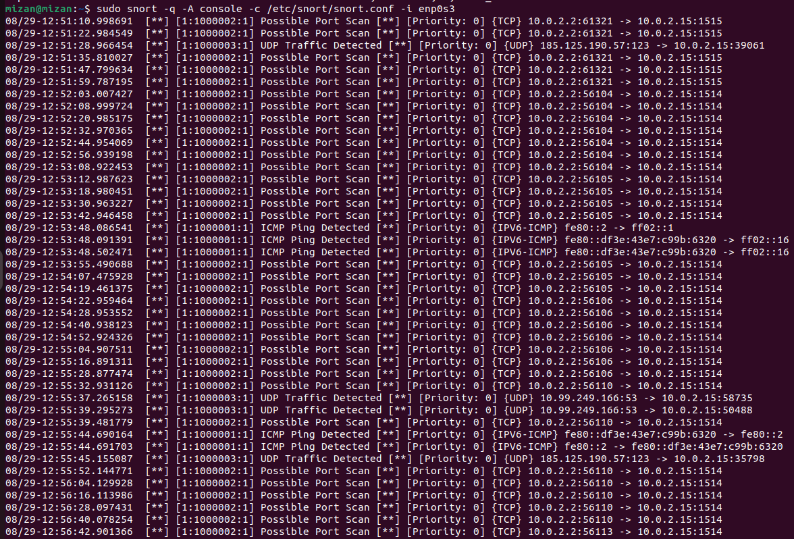

# Screenshots

## Traffic Generation - Kali

Network traffic was intentionally generated from Kali Linux for testing purposes.

The tests included:
- ICMP ping
- Nmap scanning
- hping-generated traffic

## Traffic Observation - Ubuntu

The generated traffic was monitored and analyzed on Ubuntu using Snort IDS.

The screenshots show Snort detecting the test traffic and generating alerts.

